# AsteroidsFX

A modular Asteroids game built with **JavaFX**, the **Java Platform Module System (JPMS)**, and a plugin-based architecture. Gameplay systems (player, enemies, bullets, asteroids, collision) are loaded at runtime as independent modules. Score persistence is handled by a separate **Spring Boot** microservice.

---

## Table of Contents

1. [Overview](#overview)
2. [Features](#features)
3. [Tech Stack](#tech-stack)
4. [System Architecture](#system-architecture)
5. [Module Dependency Graph](#module-dependency-graph)
6. [Work Flow](#work-flow)
7. [Game State Machine](#game-state-machine)
8. [Sequence Diagrams](#sequence-diagrams)
9. [Project Structure](#project-structure)
10. [Getting Started](#getting-started)
11. [Controls](#controls)
12. [Scoring Rules](#scoring-rules)
13. [Testing](#testing)
14. [Documentation](#documentation)
15. [License](#license)

---

## Overview

AsteroidsFX is an educational remake of the classic arcade game that demonstrates component-oriented design on the JVM:

- **JPMS modules** with clear `provides` / `uses` service contracts
- **Runtime plugin loading** via a dedicated `ModuleLayer` and `ServiceLoader`
- **Spring** for composition in the Core module
- **HTTP-backed scoring** as an out-of-process microservice

Clear all asteroids across waves, dodge enemy ships, and survive with three lives. Reach **wave 3** for victory.

---

## Features

| Feature | Description |
|---|---|
| Classic Asteroids gameplay | Thrust, rotate, shoot; wrap around screen edges |
| Asteroid splitting | Large → medium → small fragments with increasing speed |
| Enemy ships | AI-controlled foes that spawn and fire at the player |
| Wave progression | Difficulty scales per wave (more asteroids, higher speed) |
| Lives & invulnerability | Three lives with ~2.5s respawn protection |
| Menus | Start menu, pause menu, help overlay, game over / victory |
| HUD | Live score, lives, wave number, asteroids remaining |
| Sound effects | Shooting, explosions, menu navigation (muteable) |
| Responsive window | Logical 800×800 playfield scales to the window size |
| External scoring API | Score synced to Spring Boot on every score change |

---

## Tech Stack

| Layer | Technology |
|---|---|
| Language | Java 11+ (JPMS) |
| UI | JavaFX 21 |
| Build | Maven (multi-module) |
| DI / composition | Spring Framework 6 |
| Scoring service | Spring Boot (standalone JAR on port **8081**) |
| Testing | JUnit 5, Mockito |
| Module discovery | `ServiceLoader` + child `ModuleLayer` |

---

## System Architecture

The system has three runtime layers: the **boot module path** (`mods-mvn/`), a **child plugin layer** (`plugins/`), and an optional **scoring microservice** process.

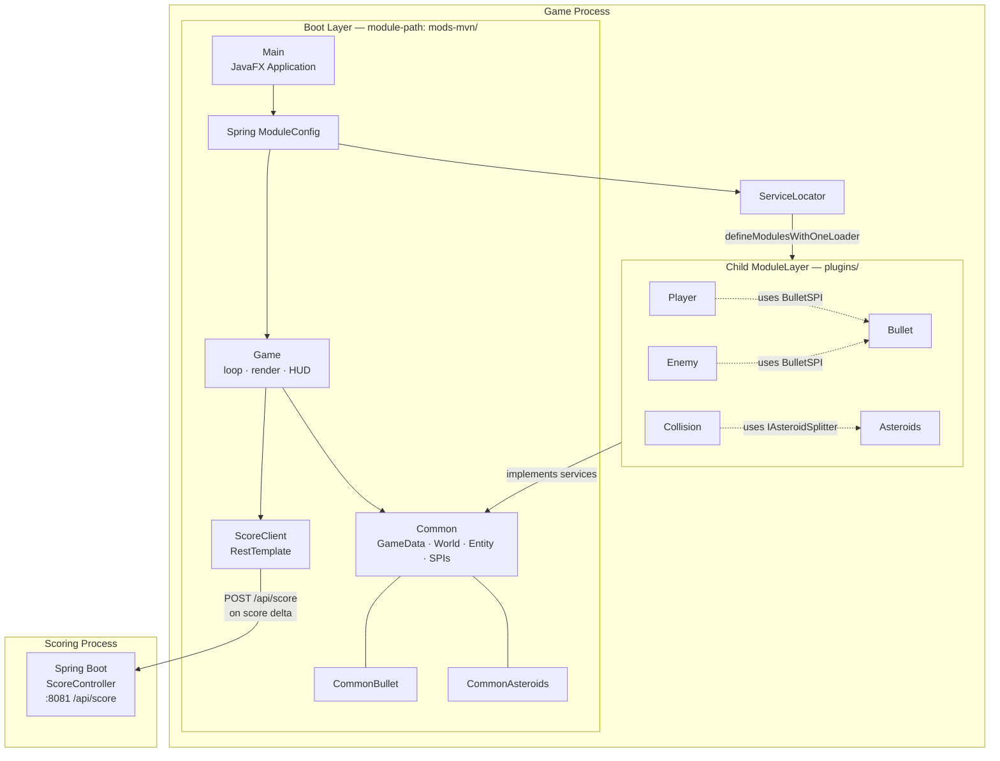

### Design principles

| Principle | How it is applied |
|---|---|
| Composition root | `Core` owns the game loop; it never `requires` Player/Enemy/Bullet/Asteroids/Collision |
| Interface segregation | Shared contracts live in `Common`, `CommonBullet`, `CommonAsteroids` |
| Plugin isolation | Gameplay jars load into a **child `ModuleLayer`** so they can be swapped without relinking Core |
| Post-processing boundary | Collision (and other cross-entity effects) run only as `IPostEntityProcessingService` after all entity processors finish |
| Externalized scoring | Authoritative score sync is a separate HTTP service (lab microservice design) |

---

## Module Dependency Graph

Who **provides** vs **uses** each service (matches `module-info.java` and `docs/ARCHITECTURE.md`):

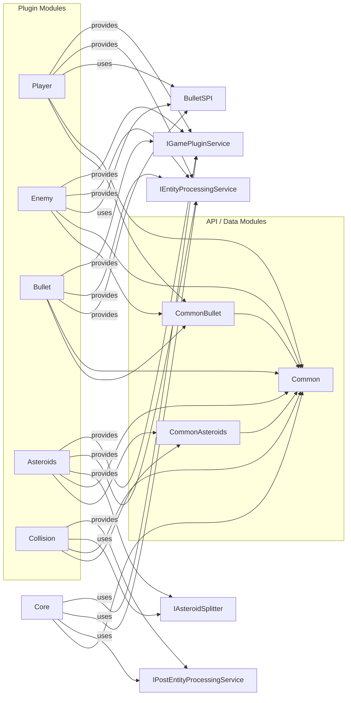

| Module | Provides | Requires (`uses`) |
|---|---|---|
| **Core** | Composition root (not a plugin) | `IGamePluginService`, `IEntityProcessingService`, `IPostEntityProcessingService` |
| **Player** | Plugin + processing | `BulletSPI` |
| **Enemy** | Plugin + processing | `BulletSPI` |
| **Bullet** | Plugin, processing, `BulletSPI` | — |
| **Asteroids** | Plugin, processing, `IAsteroidSplitter` | — |
| **Collision** | Post-entity processing | `IAsteroidSplitter` |
| **Scoring** | REST scoring API (separate process) | — |

---

## Work Flow

### A. Developer / build workflow

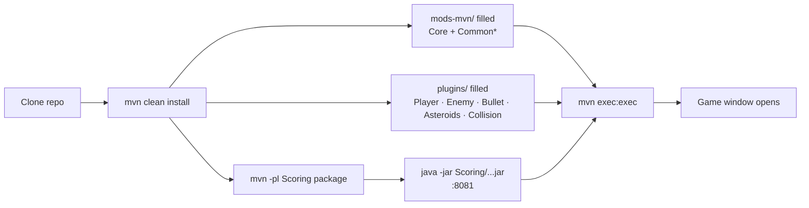

1. **`mvn clean install`** — compile, test, and copy jars into `mods-mvn/` and `plugins/`.
2. **Start Scoring** — `java -jar Scoring/target/Scoring-1.0.1-SNAPSHOT.jar` on port `8081`.
3. **`mvn exec:exec`** — launch `Core/dk.sdu.mmmi.cbse.main.Main` with `--module-path=mods-mvn`.

### B. Runtime bootstrap workflow

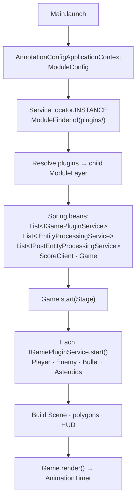

### C. Per-frame game loop workflow

When the state is **PLAYING** (not Start Menu / Paused):

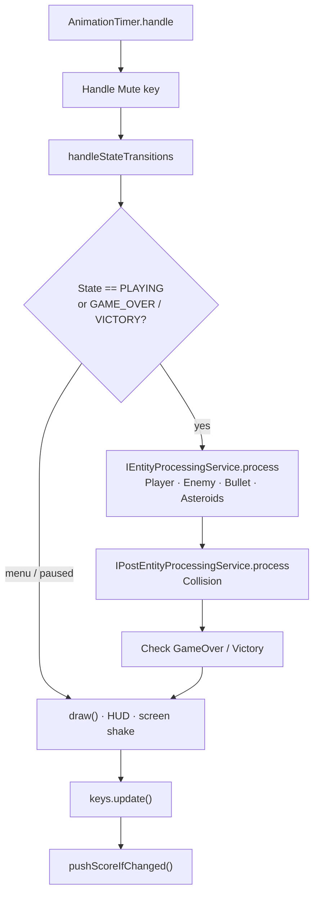

**Processing contract**

| Phase | Interface | Responsibility |
|---|---|---|
| Entity processing | `IEntityProcessingService` | Move / control **own** entities only |
| Post processing | `IPostEntityProcessingService` | Cross-entity effects (collision, split, score) after positions are final |

---

## Game State Machine

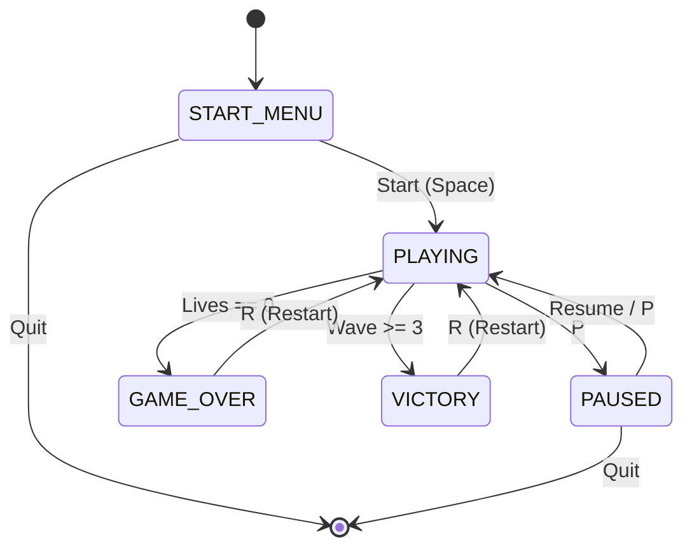

Owned by `GameStateManager` in Common; HUD and input routing in Core read this state each frame.

---

## Sequence Diagrams

### 1. Application startup

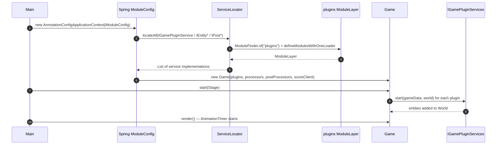

### 2. Shoot bullet (Player → BulletSPI)

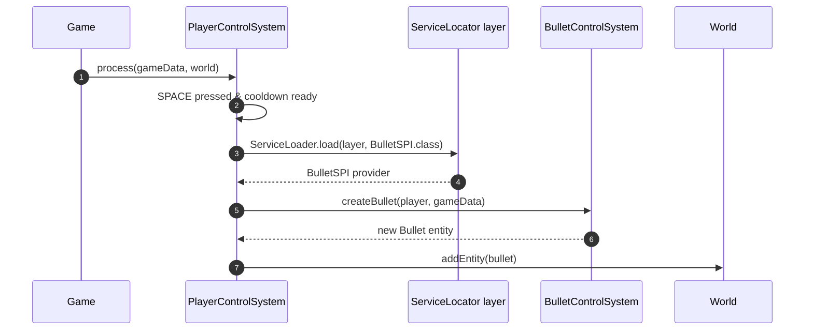

### 3. Collision, asteroid split, and local score

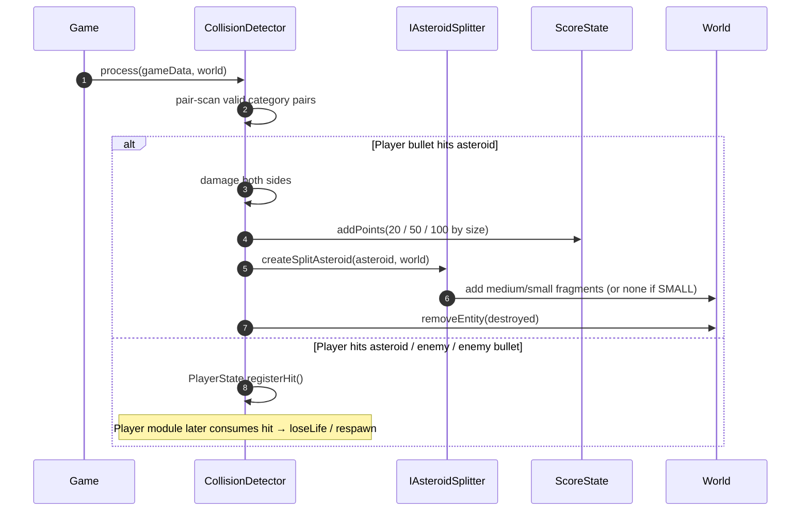

### 4. Score sync to microservice

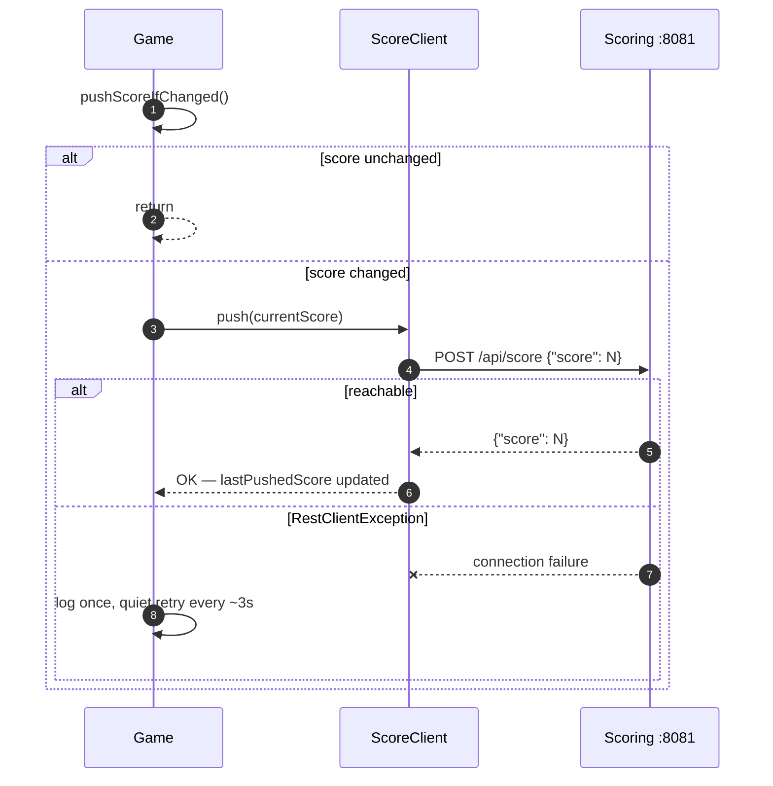

### 5. Wave clear → next wave

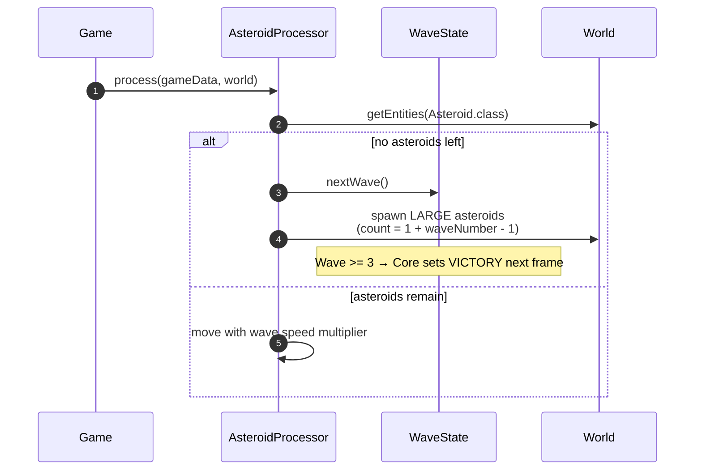

---

## Project Structure

```
AsteroidsFX-master/
├── Core/                 # JavaFX entry point, HUD, rendering, ScoreClient
├── Common/               # Shared data model & service interfaces
├── CommonBullet/         # Bullet SPI
├── CommonAsteroids/      # Asteroid types & splitter SPI
├── Player/               # Player plugin
├── Enemy/                # Enemy plugin
├── Bullet/               # Bullet plugin + BulletSPI provider
├── Asteroids/            # Asteroid spawn, movement, splitting
├── Collision/            # Post-processing collision & scoring hooks
├── Scoring/              # Standalone Spring Boot scoring microservice
├── docs/                 # Architecture, microservice, JPMS lab notes
├── mods-mvn/             # Built by Maven — Core + Common* on module path
└── plugins/              # Built by Maven — gameplay plugins for ModuleLayer
```

---

## Getting Started

### Prerequisites

- **JDK 17+** recommended (JavaFX 21 / Spring 6)
- **Maven 3.8+** (or the included wrapper: `./mvnw` / `mvnw.cmd`)

### 1. Build

```bash
mvn clean install
```

Copies:

| Destination | Modules |
|---|---|
| `mods-mvn/` | Core, Common, CommonBullet, CommonAsteroids |
| `plugins/` | Player, Bullet, Enemy, Asteroids, Collision |

Both directories must exist before launch.

### 2. Start the Scoring microservice

```bash
mvn -pl Scoring clean package
java -jar Scoring/target/Scoring-1.0.1-SNAPSHOT.jar
```

| Method | Endpoint | Description |
|---|---|---|
| `GET` | `/api/score` | Current score |
| `POST` | `/api/score` | Set score (`{"score": N}`) |
| `POST` | `/api/score/reset` | Reset to 0 |

```bash
curl http://localhost:8081/api/score
```

If the service is down, the game still runs: sync fails quietly after one log and retries about every 3 seconds. See [`docs/MICROSERVICE.md`](docs/MICROSERVICE.md).

### 3. Run the game

```bash
mvn exec:exec
```

---

## Controls

| Key | Action |
|---|---|
| ← → | Rotate |
| ↑ | Thrust |
| ↓ / ↑ | Navigate menus |
| `Space` | Shoot / confirm menu |
| `P` | Pause |
| `M` | Mute / unmute |
| `H` | Toggle help (menus) |
| `R` | Restart (Game Over / Victory) |
| `Q` | Quit (menus) |

Menu options: **Start / Resume**, **Help**, **Quit**.

---

## Scoring Rules

| Target | Points |
|---|---|
| Large asteroid | 20 |
| Medium asteroid | 50 |
| Small asteroid | 100 |
| Enemy ship | 200 |

Local score lives in `ScoreState` (Common). Core’s `ScoreClient` mirrors it to the Scoring service whenever the value changes.

---

## Testing

```bash
mvn test
mvn -pl Collision,Player,Common,CommonAsteroids test
```

Coverage includes entity behavior, player state, asteroid sizes, collision detection, and player control logic (JUnit 5 + Mockito).

---

## Documentation

| Document | Contents |
|---|---|
| [`docs/ARCHITECTURE.md`](docs/ARCHITECTURE.md) | Components, provides/requires, service contracts, known gaps |
| [`docs/MICROSERVICE.md`](docs/MICROSERVICE.md) | Scoring API, Core dependency, failure handling |
| [`docs/JPMS_LAB3_SPLIT_PACKAGE.md`](docs/JPMS_LAB3_SPLIT_PACKAGE.md) | Split-package demo and ModuleLayer isolation |

---

## License

Educational / coursework project (SDU MMMI CBSE). Adjust this section if you publish under a specific open-source license.
