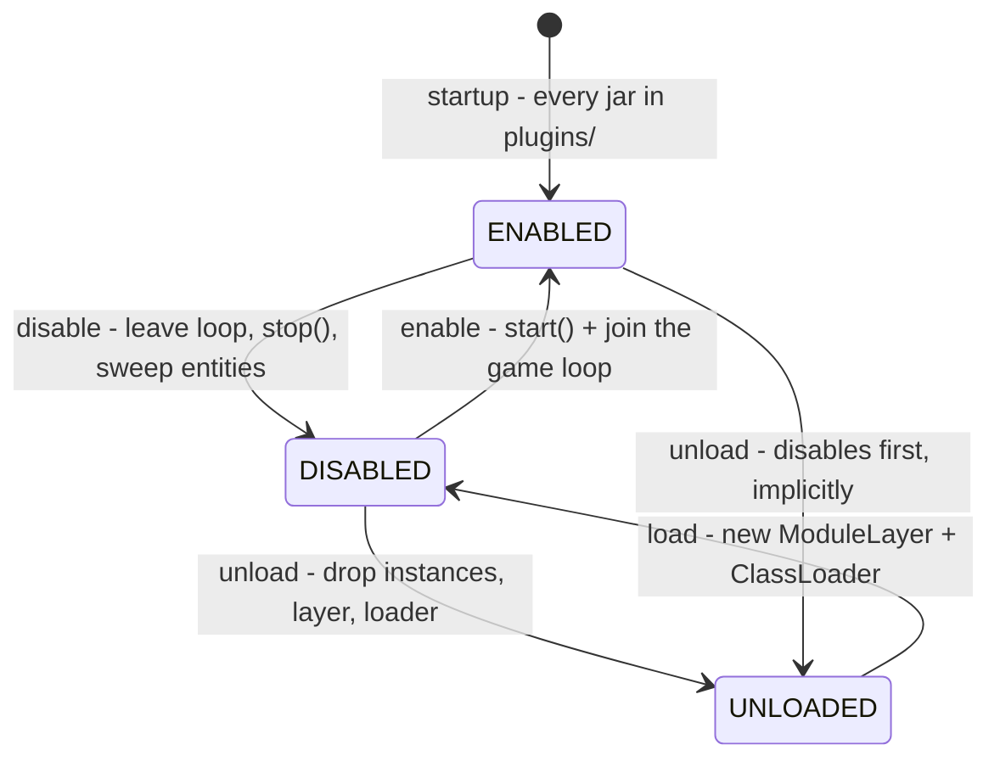
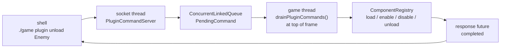

# Dynamic Plugin System — Runtime Plugin Management

This document describes the runtime plugin capability of AsteroidsFX end to
end: what it is, how it is built, how to drive it, what it guarantees, how it
was verified, and where its limits are.

**One-line summary.** A dynamic runtime plugin system with plugin lifecycle
management, allowing individual plugins to be loaded, enabled, disabled,
unloaded and reloaded without restarting the game.

**Technical mechanism.** Dynamic class loading — one JPMS `ModuleLayer` with
its own `ClassLoader` per plugin — combined with controlled lifecycle
management that removes every reference to a plugin before releasing it.

---

## 1. The six capabilities, and where each lives

| # | Capability | Implemented by |
|---|---|---|
| 1 | **Dynamic plugin loading** — plugin code loaded while the app runs | `ServiceLocator.loadPlugin` (`Common/.../util/ServiceLocator.java`) |
| 2 | **Plugin lifecycle management** — `Load → Enable → Disable → Unload → Load → Enable` | `ComponentRegistry` (`Core/.../main/ComponentRegistry.java`) |
| 3 | **Dynamic class loading** — a dedicated `ClassLoader` per plugin | `ModuleLayer.defineModulesWithOneLoader` in `ServiceLocator.defineLayerFor` |
| 4 | **Runtime jar replacement** — swap a plugin jar without restarting | `unload` releases the jar handle; `load` re-reads from `plugins/` |
| 5 | **Runtime module management** — Player, Bullet, Enemy, Asteroid, Collision managed independently | `ComponentRegistry`, keyed by JPMS module name |
| 6 | **Dependency / resource cleanup** — entities, services, caches, layer, loader | `ComponentRegistry.disable` / `.unload` + `ServiceLocator.unloadPlugin` |

> **Terminology note.** `Weapon` is *not* a module. It is a historical display
> name that `ComponentRegistry` aliases onto the `Bullet` module, so the
> existing key `3` binding and `game plugin disable Weapon` both resolve to
> the same thing. The real modules are `Player`, `Bullet`, `Enemy`,
> `Asteroid`, `Collision`.

---

## 2. States and transitions



| State | Meaning |
|---|---|
| `ENABLED` | Classes loaded, services taking part in the game loop. |
| `DISABLED` | Classes still loaded, services not ticked. Cheap to re-enable. |
| `UNLOADED` | Classes released. Only the jar on disk remains. |

The game loop keeps running through **every** transition. There is no pause,
no restart, and no second game loop.

---

## 3. Why one ModuleLayer per plugin

Originally `ServiceLocator` resolved every jar in `plugins/` into a *single*
child `ModuleLayer` sharing one loader. That is fine for discovery but makes
unloading impossible: a class is only collectable when its **entire** class
loader becomes unreachable, so releasing one plugin would have meant
releasing all five.

Now each plugin is resolved on its own against the boot layer's
configuration:

```java
Configuration configuration = ModuleLayer.boot().configuration()
        .resolve(ModuleFinder.of(pluginsDir()), ModuleFinder.of(), Set.of(moduleName));

return ModuleLayer.boot()
        .defineModulesWithOneLoader(configuration, ClassLoader.getSystemClassLoader());
```

Consequences:

- **Each plugin gets a private `ClassLoader`.** Dropping the layer makes that
  loader — and the plugin's classes, its statics, and its open jar file
  handle — collectable.
- **Shared types stay shared.** `Common`, `CommonBullet` and `CommonAsteroids`
  resolve to the *boot layer's* copies, so `Entity`, `World`, `Bullet` and
  `Asteroid` keep one identity across the whole game. This is what lets a
  reloaded plugin interoperate with entities that were already in flight.
- **Split packages remain impossible.** Two plugins exporting the same package
  can no longer even meet in one configuration.
- **Cross-plugin lookups must span layers.** `Player`/`Enemy` (`BulletSPI`) and
  `Collision` (`IAsteroidSplitter`) iterate
  `ServiceLocator.INSTANCE.getLayers()` instead of querying one layer. This is
  also why they degrade gracefully: when `Bullet` is unloaded the provider list
  simply comes back empty and nobody fires, rather than touching a missing
  class.

### 3.1 Plugins load from a staged copy, not from `plugins/`

A module layer keeps the jar it was loaded from **open** for as long as its
class loader is alive, and only the garbage collector decides when that ends.
On Windows an open file cannot be deleted or renamed at all. Loading straight
out of `plugins/` therefore made the user's own jar undeletable — not just
while the plugin was loaded, but for an unpredictable period *after* an unload,
because a single strong reference anywhere delays collection indefinitely.

`ServiceLocator.stageJarOf` copies the jar into a private staging directory
under the OS temp folder and builds the layer from *that*. Consequences:

- The jars in `plugins/` are only ever read briefly, so they can be deleted or
  replaced **at any time**, whether or not the plugin is loaded.
- Each load stages to a fresh directory, so a staged copy still held open by a
  not-yet-collected loader can never block the next load.
- Staged copies are deleted on unload, best-effort, and registered for deletion
  on JVM exit.

This also decouples the feature from garbage-collector timing: jar replacement
is now deterministic, and class-loader reclamation is a separate, purely
informational matter reported by `plugin list`.

### Why `ModuleLayer` and not `URLClassLoader`

Both give dynamic class loading. `ModuleLayer` was chosen because the project
is JPMS-based end to end: it preserves `requires`, `provides`/`uses` and strong
encapsulation across the boundary, and keeps `ServiceLoader` as the discovery
mechanism. A raw `URLClassLoader` would have discarded the module graph the
rest of the project is built on.

---

## 4. Cleanup contract — what `unload` actually releases

An `unload` is only complete when nothing can reach the plugin any more. In
order:

| Step | Where |
|---|---|
| 1. Remove services from the loop's lists | `ComponentRegistry.disable` |
| 2. Call `IGamePluginService.stop` so the plugin retires its own entities | `ComponentRegistry.disable` |
| 3. Sweep any entity whose class belongs to the plugin's loader | `ComponentRegistry.removeEntitiesOwnedBy` |
| 4. Drop the registry's references to the plugin's service instances | `ComponentRegistry.unload` |
| 5. Clear the cached `ServiceLoader` provider instances | `ServiceLocator.unloadPlugin` |
| 6. Drop the `ModuleLayer` and its `ClassLoader` | `ServiceLocator.unloadPlugin` |
| 7. Hint the GC, so the jar handle is released and the release is observable | `ComponentRegistry.unload` |

Step 3 is the safety net: plugins are *expected* to retire their own entities
in `stop()`, but the sweep guarantees the invariant the rest of the game relies
on — **after a plugin is disabled or unloaded, no live entity references one of
its classes.**

Two deliberate details:

- **Entities of shared types are not swept.** `Bullet` and `Asteroid` are
  defined in `CommonBullet`/`CommonAsteroids` (boot layer), not in the plugin,
  so they outlive their producer by design. `BulletPlugin.stop` and
  `AsteroidPlugin.stop` remove them explicitly instead.
- **Spring must not pin the instances.** The three service-list beans in
  `ModuleConfig` are prototype-scoped. As singletons the container held a
  `List` referencing every plugin service for the life of the JVM, which
  survived an `unload` and kept the loader alive — the plugin could never
  actually leave. `ComponentRegistry` is now the single owner of the live
  instances.

---

## 5. Command channel and thread safety

The game loop is a JavaFX `AnimationTimer` on the application thread. A shell
command arrives on a socket thread. Mutating plugin state from the socket
thread would race `update()`, so it never happens:



- `PluginCommandServer` **never touches game state**. It only parks a
  `PendingCommand` on a queue and waits (5 s) for the future to complete.
- `Game.drainPluginCommands()` runs at the **top of `handle()`**, before input
  handling and before `update()`. A plugin therefore always changes *between*
  two updates, never inside one.
- The loop's service lists are `CopyOnWriteArrayList`, so even a concurrent
  read during iteration cannot throw `ConcurrentModificationException`.
- `World` is backed by a `ConcurrentHashMap` and the entity sweep iterates a
  copy, so removal cannot corrupt the collection.
- The listener binds to the **loopback address only** — nothing is exposed to
  the network. If the port is unavailable the game logs and runs normally
  without the channel.

---

## 6. Using it

Build and start the game as usual, from the repo root:

```bash
mvn clean install
```

```bash
mvn exec:exec --non-recursive
```

Then, from a second terminal in the same directory:

```bash
./game plugin list
```

```bash
./game plugin disable Enemy
```

```bash
./game plugin unload Enemy
```

```bash
./game plugin load Enemy
```

```bash
./game plugin enable Enemy
```

`./game` (bash, uses the built-in `/dev/tcp`) and `game.cmd` (Windows) are
equivalent. The port defaults to `5599` and is overridable with
`-Dasteroids.plugin.port=` on the game and `ASTEROIDS_PLUGIN_PORT` on the
script.

| Command | Effect |
|---|---|
| `plugin list` | Every plugin, its state, and — when unloaded — whether its class loader has actually been collected |
| `plugin load <name>` | Resolve the jar into a fresh layer/loader; leaves the plugin `DISABLED` |
| `plugin enable <name>` | `start()` + join the game loop |
| `plugin disable <name>` | Leave the loop + `stop()` + entity sweep |
| `plugin unload <name>` | Disable if needed, then release instances, layer and loader |
| `plugin reload <name>` | `unload` + `load` + `enable`, back to back in one frame |

Names are case-insensitive and accept the historical aliases (`Weapon` →
`Bullet`, `Asteroids` → `Asteroid`). Keys `1`/`2`/`3` still toggle
Player/Enemy/Weapon exactly as before.

### Replacing a jar at runtime

Plugins are loaded from a **private staged copy**, never straight out of
`plugins/` (see §3.1), so the jars in `plugins/` are never held open. They can
be deleted, replaced or upgraded at any moment while the game is running —
including while the plugin is loaded and enabled.

```text
cp new/Enemy-1.0.1-SNAPSHOT.jar plugins/   # allowed at any time
./game plugin reload Enemy                 # picks up whatever is on disk now
```

The running plugin keeps working from its staged copy until you reload it, so
replacing a jar never disturbs the frame in progress.

---

## 7. Error handling

No plugin failure may take the game down.

- A `stop()` that throws is logged; the plugin is already off the update path.
- A `start()` that throws rolls back — the plugin is stopped again, its
  entities swept, and it stays `DISABLED` rather than half-installed.
- A failed `load` (missing module, unresolvable jar) is reported to the caller
  and leaves the plugin `UNLOADED`.
- Unknown plugin names and unknown actions return a usage message.
- Any exception escaping a command is caught in `drainPluginCommands` and
  returned as text — critical, because an exception thrown out of
  `AnimationTimer.handle()` would stop the timer and freeze the game.

---

## 8. Verification

Executed against a **single running game instance**, driven entirely from a
shell.

| Check | Result |
|---|---|
| Spec sequence: start → confirm Enemy → `disable` → `unload` → `load` → `enable` | Passed |
| Enemy unloaded mid-play; game kept running | Score advanced 0 → 1160, Wave 1 → 2 in the same process |
| Enemy functionality genuinely stopped | No enemy on screen, and none respawned in 10 s despite the 3 s respawn timer |
| Enemy restored | Saucer and health bar back after `load` + `enable` |
| 10 consecutive `disable → unload → load → enable` cycles | All passed, stable |
| Full cycle on all five modules | Each reported `class loader released`; only the target was affected |
| Class loader actually collected | `plugin list` reports `class loader released` after `unload` |
| Jar deletable while plugin **loaded and enabled** | `Bullet-1.0.1-SNAPSHOT.jar` deleted mid-run with no lock; the plugin kept working from its staged copy |
| All five jars deleted at once mid-run | `plugins/` emptied while playing; game unaffected; all restored and reloaded |
| Missing jar handled | `load Bullet` with no jar on disk reports the error and leaves the game running |
| Error paths (`unload Nonexistent`, `load Nonexistent`, bad action, empty command) | Handled, game unaffected |
| 93 commands total | **Zero** unexpected exceptions — no `NullPointerException`, `ConcurrentModificationException`, `ClassNotFoundException` or `NoClassDefFoundError` |
| `mvn clean install` | Green, full test suite passing |

---

## 9. Known limits

Stated explicitly so the capability is not over-claimed.

- **No automatic hot swap.** Nothing watches `plugins/` for changes. A modified
  jar is only picked up after an explicit `unload` … `load`. There is no
  in-place class redefinition of a *currently loaded* plugin (no JVMTI
  HotSwap / instrumentation agent).
- **Jar replacement is verified as unlocked, not as behaviour-changing.** The
  jar was proven removable and re-readable at runtime; substituting a jar
  containing *different code* and observing the changed behaviour has not been
  exercised.
- **No lifecycle hook for plugin-owned threads or external listeners.**
  `IGamePluginService` exposes only `start`/`stop`. Every resource the current
  plugins create is covered, but a future plugin that spawned a thread, timer,
  executor or registered an outside listener would have nothing to shut it
  down, and its loader would leak. Adding a `close()`/`dispose()` step to the
  service interface is the natural extension.
- **Class-loader reclamation is GC-dependent, and not always achieved.**
  `unload` drops every reference this system holds and then waits (off the game
  thread) for the loader to be collected. In practice some plugins are reclaimed
  and others are not: `Player` and `Bullet` have been observed still reachable
  after a forced full GC, so a strong reference survives somewhere — most likely
  a JDK-internal or JavaFX-side cache rather than this code, but it has not been
  traced to its root. `plugin list` reports the true state rather than assuming
  success.

  This is a **diagnostic** limitation, not a functional one: because plugins load
  from a staged copy, replacing a jar never depended on reclamation. What an
  unreclaimed loader does cost is memory — repeatedly unloading and reloading such
  a plugin retains the old classes, so it is not suitable as an indefinite
  hot-reload loop for those two components.
- **Startup still loads every jar in `plugins/`.** Selective startup loading is
  not implemented; unwanted plugins are disabled or unloaded after the fact.

---

## 10. Files involved

| File | Role |
|---|---|
| `Common/src/main/java/dk/sdu/mmmi/cbse/common/util/ServiceLocator.java` | Per-plugin `ModuleLayer`/`ClassLoader` registry; `loadPlugin`, `unloadPlugin`, `getLayers`, `locateAll`, `isClassLoaderReleased` |
| `Core/src/main/java/dk/sdu/mmmi/cbse/main/ComponentRegistry.java` | Lifecycle state machine, active service lists, entity sweep |
| `Core/src/main/java/dk/sdu/mmmi/cbse/main/PluginCommandServer.java` | Loopback command listener; queue handoff to the game thread |
| `Core/src/main/java/dk/sdu/mmmi/cbse/main/Game.java` | `drainPluginCommands()` at frame start; command parsing |
| `Core/src/main/java/dk/sdu/mmmi/cbse/main/ModuleConfig.java` | Prototype-scoped service lists so Spring does not pin plugin instances |
| `Enemy/.../EnemyControlSystem.java`, `Player/.../PlayerControlSystem.java`, `Collision/.../CollisionDetector.java` | Cross-plugin SPI lookups iterate `getLayers()` |
| `game`, `game.cmd` | Shell entry points |
